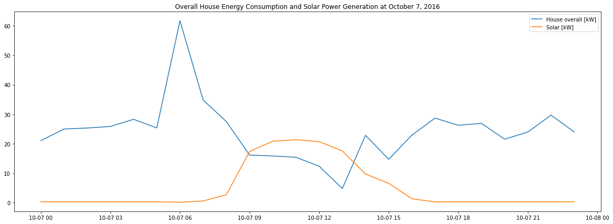
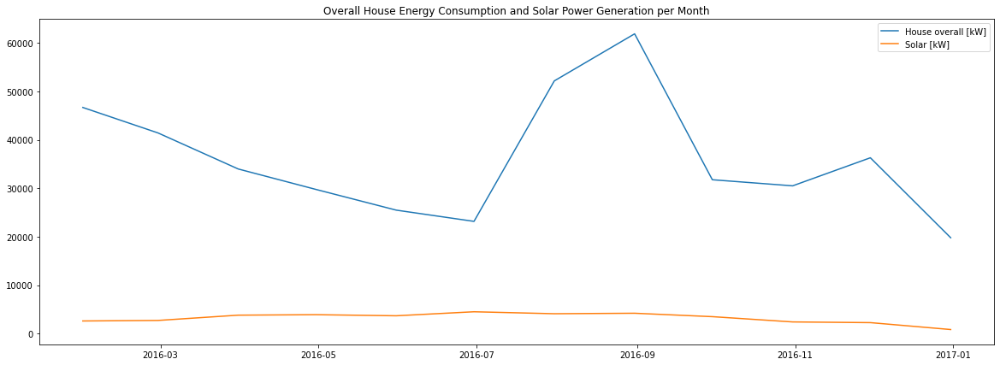

From the above plot, the balance between overall house energy consumption and solar power generation was 9:00 and 13:30.

From the above plot, overall house energy consumption was greater than solar power generation in 2016.

{\%\ include Energy-saving House.htm \%\}

